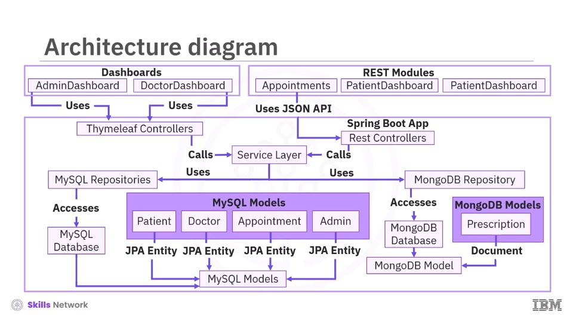

# Architecture summary

El sistema "smart clinic" está constituido por una arquitectura de 3 capas:

1. **Capa de presentación**: Interfaz de usuario constituida por Thymeleaf templates con una arquitectura 
model-view-controller (MVC) y consumidores de API REST.

2. **Capa de aplicación**: Spring Boot como backend, contiene controladores, servicios y lógica de negocio. Esta capa se
comunica con la capa de presentación por medio de data-transfer-object (DTO) y con entidades de dominio hacia la capa 
de datos.

3. **Capa de datos**: MySQL para datos estructurados como: administradores, doctores, pacientes, citas y administración;
utilizando entidades JPA. MongoDB para flexibilidad en datos como: recetas médicas; usando modelos de documentos. Esta 
capa es accesible a través de patron repository.

---

# Numbered flow of data and control

1. **User interface layer**. El sistema soporta a distintos tipos de usuarios y puede interactuar por medio de su página web o API REST.
   - Vista web de Admin dashboard o doctor dashboard.
   - Clientes REST API como apps móviles o módulos frontend (ej. Citas, registro de pacientes, panel de control de paciente)
   que interactúan con el backend via HTTP y reciben respuestas JSON.

2. **Controller layer**. Cuando un cliente se comunica con la aplicación el controlador recibe la solicitud la cual es enrutada en base a la
ruta de la URL y el método HTTP.
    - Solicitud para renderizado de vistas desde el servidor son controlados por thymeleaf controller, respondiendo con 
   una vista `.html`.
    - Solicitud para clientes API REST son controlados por REST controllers y responden con formato JSON.

3. **Service layer**. El controlador delega la lógica a la capa de servicio.
    - Aplica validaciones y reglas de negocio.
    - Transformación de DTO y entidad de dominio.
    - Coordina procesos de negocio - flujos de trabajo a través de distintas entidades. (cómo verificación de 
   disponibilidad del doctor antes de hacer una cita).

4. **Repository layer**. Para operaciones de consulta o persistencia de información la capa de servicio se comunica con  
la capa de repositorio. Esta capa incluye 2 tipos de repositorios:
   - Repositorio MySQL con Spring Data JPA.
   - Repositorio MongoDB con Spring Data MongoDB.

5. **Database Access**. Los repositorios se comunican con el respectivo motor de base de datos: MySQL o MongoDB.

6. **Model binding**. Cuando los datos son recuperados de la base de datos estos con convertidos a clases de modelo java
que son anotadas como entidad JPA `@Entity` si viene de MySQL u objetos de documentos `@Document` si viene de MongoDB.

7. **Application models in use**. Finalmente, la respuesta a la solicitud es retornada al cliente.
   - En un `flujo MVC`, el modelo con la información es cargado a la vista respectiva para ser renderizada y visualizada
   desde el navegador.
   - En un flujo `REST API` el modelo es mapeado a un DTO y serializado a un formato JSON como respuesta HTTP. 